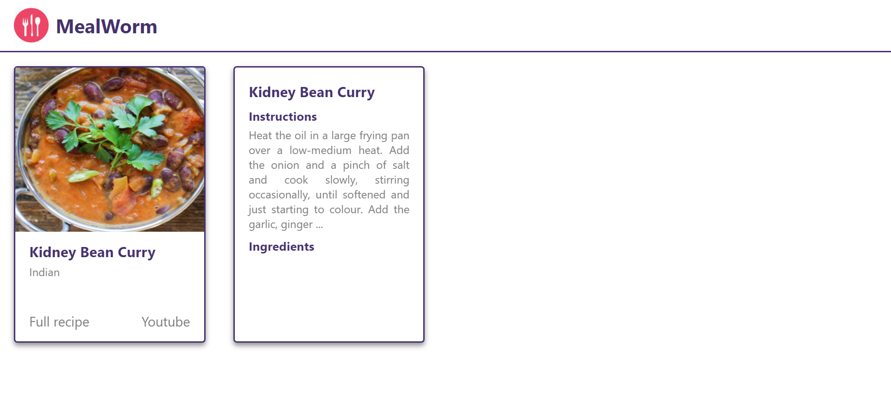
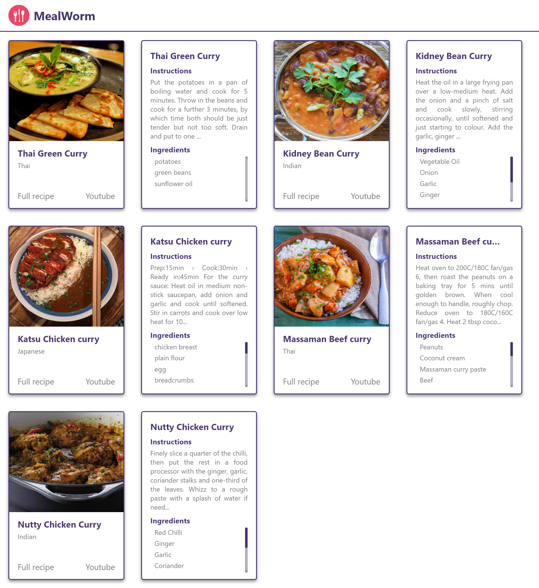

# CHALLENGE NOTES

- In App.jsx map over the recipes data and produce one CardBack component for each object of data (see screenshot)

## EXTENSION

- Find a way to produce alternating CardFront and CardBack components (see second screenshot)

## Solution screenshot

## Completed branch

7-font-awesome-ca
